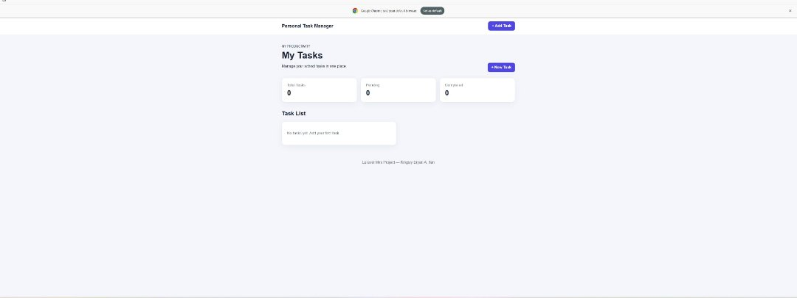
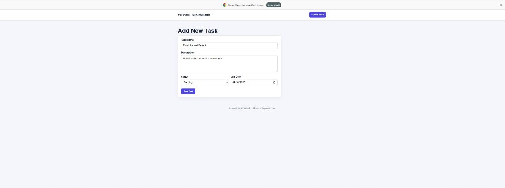
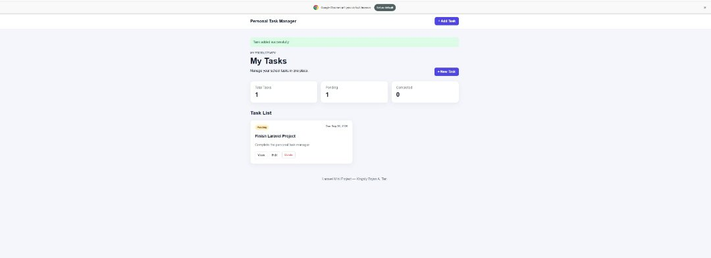
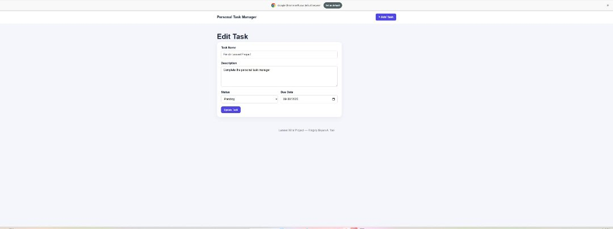
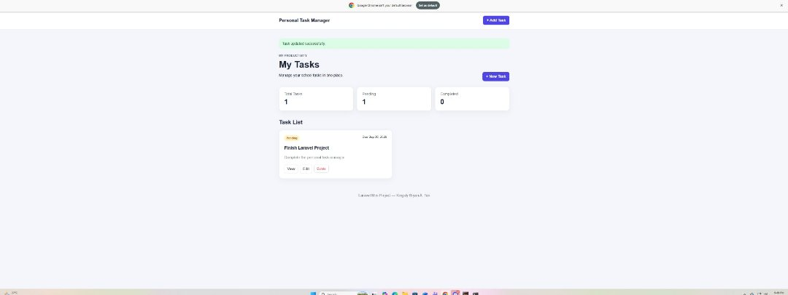
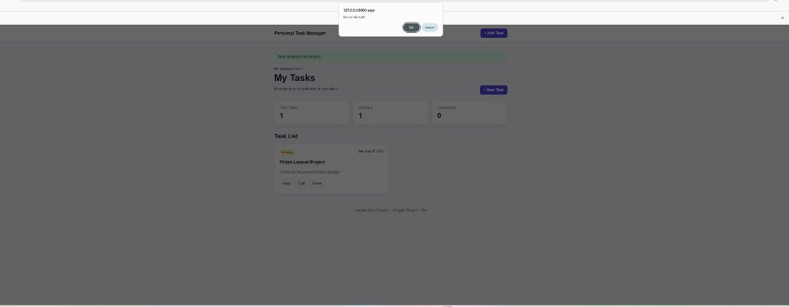

Personal Task Manager

Project Code: WST21-PM-2026-SF
Student: Joshua Layos
Course: BSIT - 2nd Year
Database: MySQL
Environment: XAMPP

Description

A simple Laravel system for managing tasks. Users can add, view, edit, complete, and delete tasks.

Features

- Add Task
- View Task
- Edit Task
- Delete Task
- Change Status
- Description and Due Date
- Dashboard Counters

Technologies

Laravel, PHP, MySQL, Blade, HTML, CSS, XAMPP

Laravel Flow

User → Blade → Route → Controller → Model → MySQL → Blade

Main Code

routes/web.php

use App\Http\Controllers\TaskController;

Route::resource('tasks', TaskController::class);

Task Model

protected $fillable = [
    'task_name',
    'description',
    'status',
    'due_date',
];

Database

Database: task_manager
Table: tasks

id
task_name
description
status
due_date
created_at
updated_at

CRUD

Create → Add Task
Read   → View Task
Update → Edit Task
Delete → Delete Task

System Screenshots

## System Screenshots

### Dashboard

### Add New Task

### Task List

### Edit Task

### Completed Task

### Delete Task

How to Run

1. Start Apache and MySQL in XAMPP.
2. Open the project folder in Command Prompt.
3. Run:

php artisan serve

4. Open:

http://127.0.0.1:8000/tasks

Outputs

The system can add, display, edit, complete, and delete tasks. The dashboard also shows the total, pending, and completed tasks.
